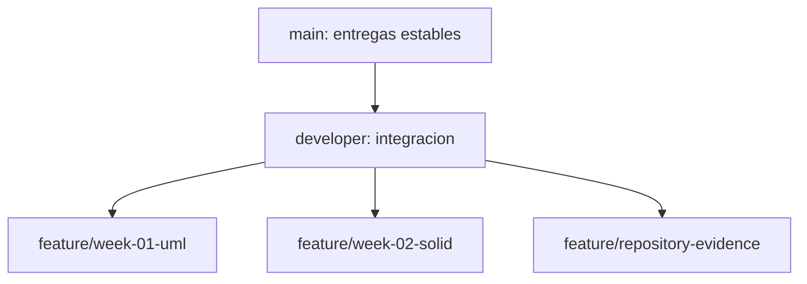

# ASII-28 - QA funcional y matriz de regresion

Repositorio personal publico de **Didhyer Alexander Ortiz Guevara**
([`DidhyerOrtiz`](https://github.com/DidhyerOrtiz)) para documentar los avances de
las semanas 1 y 2 de Analisis de Sistemas II.

**Modulo asignado:** ASII-28 - QA funcional, pruebas manuales y matriz de
regresion.

## Entregas

| Semana | Alcance | Evidencia | Rama de referencia |
|---|---|---|---|
| 1 | Diagnostico, actores, limites, procesos y diagramas UML | [`week-01/`](week-01/) | [`feature/week-01-uml`](../../tree/feature/week-01-uml) |
| 2 | RF/RNF, criterios de aceptacion y aplicacion de LSP | [`week-02/`](week-02/) | [`feature/week-02-solid`](../../tree/feature/week-02-solid) |

## Modelo de ramas

El repositorio expone la estructura solicitada para separar trabajo estable,
integracion y avances por caracteristica:

```text
main
└── developer
    ├── feature/week-01-uml
    ├── feature/week-02-solid
    └── feature/repository-evidence
```



Las ramas de semana conservan puntos verificables del historial exportado desde
el repositorio colaborativo. Las etiquetas de entrega son:

- `semana-1-entrega`
- `semana-2-entrega`

La trazabilidad de ramas, commits y contribuciones al proyecto se encuentra en
[`EVIDENCIA_GIT.md`](EVIDENCIA_GIT.md).

## Semana 1

La primera semana define el contexto del modulo, sus actores, limites y casos de
uso. Incluye diagramas de casos de uso, actividad y secuencia, junto con sus
fuentes Mermaid editables.

- [Indice de semana 1](week-01/README.md)
- [Narrativa y alcance](week-01/01-narrativa-alcance.md)
- [Actores](week-01/02-actores.md)
- [Limites y procesos](week-01/03-limites-procesos.md)
- [Casos de uso](week-01/04-casos-de-uso.md)
- [Diagramas y fuentes editables](week-01/diagramas/)

## Semana 2

La segunda semana convierte el alcance en requisitos verificables, criterios de
aceptacion y trazabilidad. El ejemplo autocontenido demuestra la correccion de
una violacion del principio de sustitucion de Liskov (LSP).

- [Indice de semana 2](week-02/README.md)
- [Requisitos funcionales y no funcionales](week-02/01-requisitos-rf-rnf.md)
- [Criterios de aceptacion](week-02/02-criterios-aceptacion.md)
- [Aplicacion de LSP](week-02/03-solid-lsp.md)
- [Contratos y responsabilidades](week-02/04-contratos-responsabilidades.md)
- [Evidencia de validacion](week-02/EVIDENCIA.md)
- [Declaracion de uso de IA](week-02/DECLARACION_IA.md)

## Validacion rapida

Desde la raiz del repositorio:

```bash
php -l week-02/ejemplos/validar-sustitucion.php
php week-02/ejemplos/validar-sustitucion.php
git branch --all
git log --oneline --decorate --graph --all
```

La demostracion PHP debe finalizar con `Resultado: 20/20 validaciones superadas.`
Todos los datos y escenarios son ficticios y no contienen informacion clinica
identificable.

## Proyecto colaborativo

Los avances se integran tambien en
[`compilations-teams/sistema-hospitalario-integrado-SistenasII-2026`](https://github.com/compilations-teams/sistema-hospitalario-integrado-SistenasII-2026)
mediante el issue [`ASII-28`](https://github.com/compilations-teams/sistema-hospitalario-integrado-SistenasII-2026/issues/28)
y pull requests sujetos a revision del equipo.
