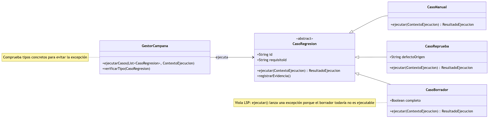
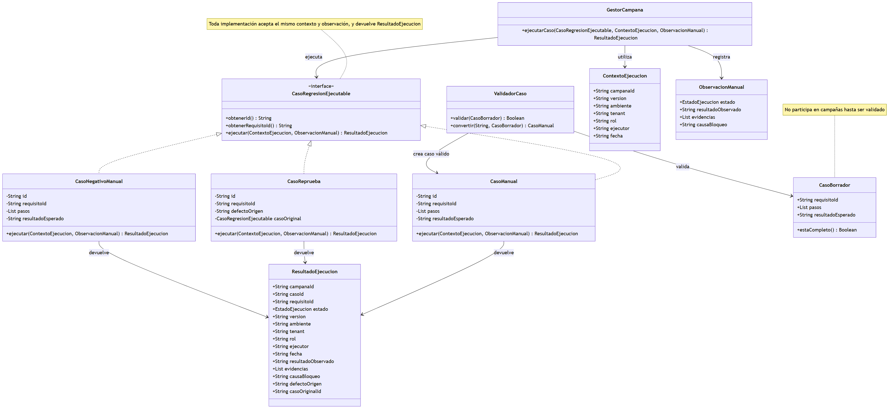

# ASII-28 - Semana 2

**Estudiante:** Didhyer Alexander Ortíz Guevara (`DidhyerOrtiz`)<br>
**Módulo:** QA funcional, pruebas manuales y matriz de regresión<br>
**Entrega:** RF/RNF, criterios de aceptación y ejemplo SOLID

## Propósito

Esta entrega convierte el alcance y los casos de uso de la semana 1 en requisitos
verificables. También propone un diseño basado en el principio de sustitución de
Liskov (LSP) para que el gestor de campañas pueda ejecutar distintos tipos de casos
de regresión sin comprobar sus clases concretas ni recibir comportamientos
incompatibles.

El ejemplo LSP es una propuesta de diseño para el módulo ASII-28. No representa una
implementación funcional ya integrada en el HIS.

## Alcance

- Definir requisitos funcionales y no funcionales del proceso manual de QA.
- Especificar criterios de aceptación trazables con los casos de uso de semana 1.
- Mostrar una violación de LSP y su corrección mediante un diseño antes/después.
- Establecer el contrato común de los casos ejecutables.
- Conservar fuentes Mermaid editables y evidencia de validación local.

## Fuera de alcance

- Implementar el gestor de campañas dentro de la aplicación.
- Automatizar pruebas E2E, configurar CI o desplegar infraestructura.
- Modificar funcionalidades clínicas evaluadas por QA.
- Utilizar datos reales o información clínica identificable.

## Contenido

1. [Requisitos funcionales y no funcionales](01-requisitos-rf-rnf.md)
2. [Criterios de aceptación y trazabilidad](02-criterios-aceptacion.md)
3. [Aplicación del principio LSP](03-solid-lsp.md)
4. [Contratos, responsabilidades y dependencias](04-contratos-responsabilidades.md)
5. [Validación del diseño LSP](05-validacion-lsp.md)
6. [Diseño anterior editable](diagramas/01-diseno-antes-lsp.mmd)
7. [Diseño mejorado editable](diagramas/02-diseno-despues-lsp.mmd)
8. [Demostración PHP](ejemplos/validar-sustitucion.php)
9. [Evidencia de validación](EVIDENCIA.md)
10. [Declaración de uso de IA](DECLARACION_IA.md)

## Diagramas

### Antes de LSP



`CasoBorrador` hereda una operación que no puede cumplir. El gestor necesita comprobar
el tipo concreto antes de ejecutar y la sustitución deja de ser segura.

### Después de LSP



`CasoManual`, `CasoReprueba` y la extensión demostrativa `CasoNegativoManual`
implementan `CasoRegresionEjecutable`. `CasoBorrador` permanece fuera de la campaña
hasta que `ValidadorCaso` produce un caso válido.

## Validación rápida

Desde la raíz del repositorio:

```bash
php -l docs/asii-28/week-02/ejemplos/validar-sustitucion.php
php docs/asii-28/week-02/ejemplos/validar-sustitucion.php
```

Resultado esperado:

```text
Resultado: 18/18 validaciones superadas.
```

Para volver a generar las imágenes con Mermaid CLI:

```bash
npx --yes @mermaid-js/mermaid-cli@11.16.0 -i docs/asii-28/week-02/diagramas/01-diseno-antes-lsp.mmd -o docs/asii-28/week-02/diagramas/imagenes/diseno-antes-lsp.png -b white -w 2000 -s 2
npx --yes @mermaid-js/mermaid-cli@11.16.0 -i docs/asii-28/week-02/diagramas/02-diseno-despues-lsp.mmd -o docs/asii-28/week-02/diagramas/imagenes/diseno-despues-lsp.png -b white -w 1800 -s 2
```

## Cumplimiento

| Requisito de semana 2 | Evidencia |
|---|---|
| Definir RF y RNF | `01-requisitos-rf-rnf.md` |
| Definir criterios de aceptación | `02-criterios-aceptacion.md` |
| Mantener trazabilidad con semana 1 | Matriz de `02-criterios-aceptacion.md` |
| Aplicar al menos un principio SOLID | LSP en `03-solid-lsp.md` |
| Presentar diseño verificable | Fuentes Mermaid, PNG y demostración PHP |
| Utilizar la fuente indicada | Cita y bibliografía de MVP Cluster |
| Conservar evidencia | `05-validacion-lsp.md` y `EVIDENCIA.md` |

## Conclusión

El diseño inicial confundía un borrador con un caso listo para ejecutar. La corrección
separa ambos estados y define una interfaz que expresa únicamente el comportamiento
común garantizado. Como resultado, una campaña puede sustituir `CasoManual` por
`CasoReprueba` sin cambiar su algoritmo, aceptar resultados incompatibles ni capturar
excepciones de operaciones no soportadas.

Los requisitos, criterios y escenarios conservan la trazabilidad con los procesos de
semana 1. La propuesta sigue limitada al diseño y a una demostración autocontenida;
su integración con persistencia, UI y módulos clínicos corresponde a fases posteriores.

## Fuente SOLID

- Rodríguez González, L. M. (s. f.). *Principios básicos del diseño de software*.
  MVP Cluster. https://mvpcluster.com/diseno-de-software-2/
- Mermaid. (s. f.). *Class diagrams*.
  https://mermaid.js.org/syntax/classDiagram.html
- PHP Documentation Group. (s. f.). *PHP Manual*. https://www.php.net/docs.php
